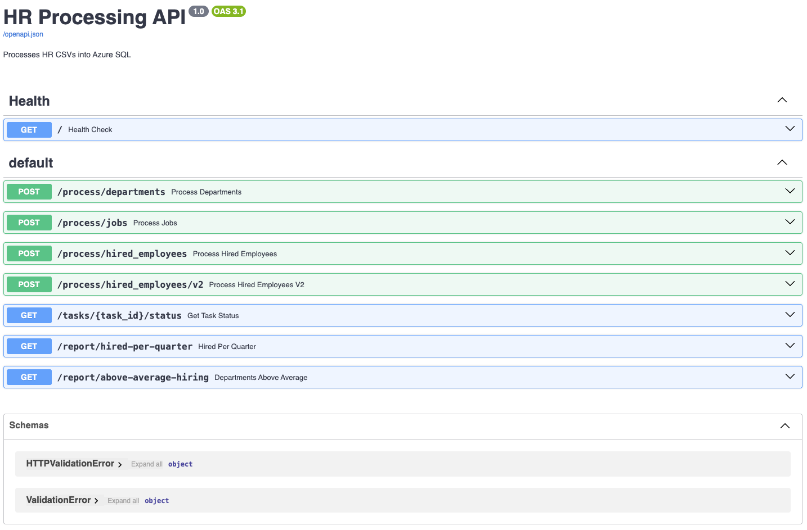

# Python-FastAPI-RQ-Redis

# Human Resources Data Pipeline

Backend application built with Python to process CSV files from Azure Blob Storage and load the data into Azure SQL Server. It exposes RESTful services using FastAPI and supports synchronous processing, background tasks, and distributed job queues with Redis + RQ.


## Technologies

* Python 3.13
* FastAPI
* aioodbc (async SQL Server connection)
* BackgroundTasks
* Redis + RQ
* Azure Blob Storage
* Docker & docker-compose
* Pytest + coverage

## Project Structure

```
.
├── Dockerfile
├── README.md
 └── main.cpython-313.pyc
├── adapters
  ├── db
 ├── queue
 └── storage
├── application
 ├── background.py
 └── tasks.py
├── docker-compose.yml
├── domain
  
 ├── models.py
 ├── ports.py
 └── services.py
├── estructura.txt
├── interfaces
 └── api
├── main.py
├── requirements.txt
├── tests
 ├── conftest.py
 ├── test_department.py
 ├── test_hired_emplyees.py
 ├── test_jobs.py
 ├── test_main.py
 ├── test_reports.py
 └── test_task_status.py
└── venv
    ├── bin
    ├── include
    ├── lib
    └── pyvenv.cfg
```

## Local Setup

```bash
python -m venv venv
source venv/bin/activate
pip install -r requirements.txt
```

### Environment Variables (`.env`)

```
AZURE_STORAGE_CONNECTION_STRING=...
AZURE_STORAGE_CONTAINER=humanresources
AZURE_SQL_CONNECTION_STRING=Driver={ODBC Driver 18 for SQL Server};...
REDIS_URL=redis://...
```

### Run API Locally

```bash
uvicorn main:app --reload
```

## Main Endpoints

http://127.0.0.1:80/docs



### CSV Processing

* `POST /process/departments` – sync processing
* `POST /process/jobs` – background task
* `POST /process/hired_employees?start=0&limit=1000` – Redis RQ batch
* * `POST /process/hired_employees/v2?start=0&limit=1000` –  background task

#### Example Response

```json
{
  "departments": {
    "processed": 12,
    "inserted": 0,
    "already_exists": 12,
    "errors": 0
  }
}
```

### Job Status

* `GET /tasks/{task_id}/status`

#### Example Response

```json
{
  "hired_employees": {
    "processed": 1000,
    "inserted": 967,
    "already_exists": 0,
    "errors": 33,
    "error_ids": [2, 67, 84, 87, ...]
  }
}
```

### Analytics Reports

* `GET /report/hired-per-quarter`

  * Returns employees hired by department/job per quarter of 2021
* `GET /report/above-average-hiring`

  * Returns departments with above-average hiring

#### Example Response `/report/above-average-hiring`

```json
[
  {"id": 7, "department": "Staff", "hired": 45},
  {"id": 9, "department": "Supply Chain", "hired": 12}
]
```

## Run with Docker

```bash
docker-compose up --build
```

Creates 3 containers:

* `app`: FastAPI application
* `worker`: RQ job consumer
* `redis`: task queue

## Run Tests

```bash
coverage run -m pytest
coverage report -m
```

## Deploy on Azure Web App for Containers

1. Push image to Azure Container Registry:

```bash
docker buildx build --platform linux/amd64 -t globantregistry.azurecr.io/hr-app:v4 --push .

az webapp config container set \
  --name hr-api-app \
  --resource-group Globant_Challenge \
  --container-image-name $ACR_NAME.azurecr.io/$IMAGE_NAME:v4 \
  --container-registry-url https://$ACR_NAME.azurecr.io \
  --container-registry-user $ACR_NAME \
  --container-registry-password $ACR_PASSWORD
```

2. Create a Web App for Containers
3. Set image to `myacr.azurecr.io/hr-app:latest`
4. Set environment variables in App Settings

## Authors

* Nelson \[[nelsong.salazar@gmail.com](mailto:nelsong.salazar@gmail.com)]